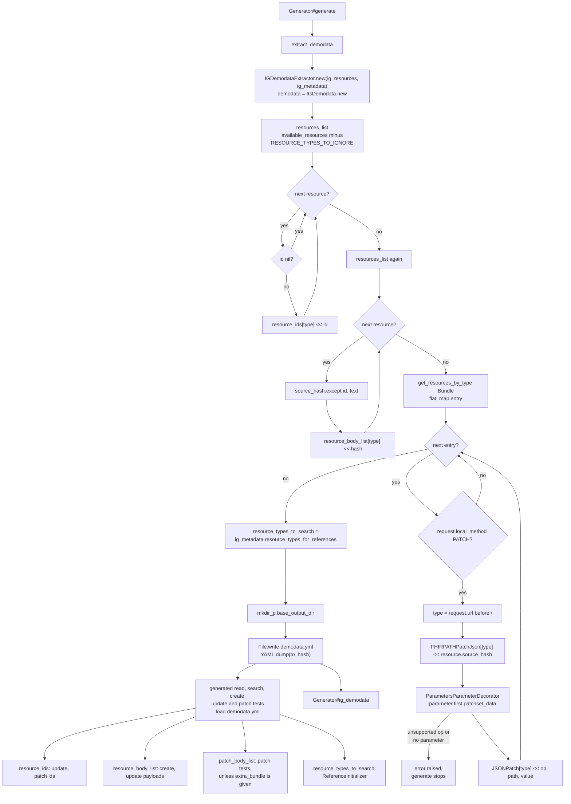
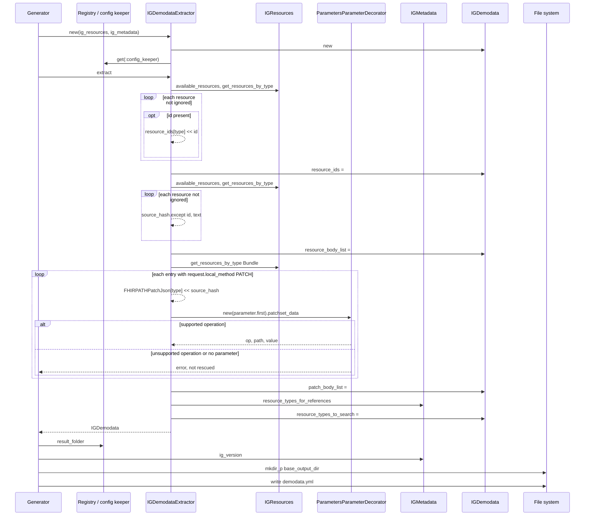

# extract_demodata: how IG examples become test payloads

Source files:

- [lib/inferno_suite_generator.rb](../lib/inferno_suite_generator.rb) (Generator#extract_demodata, Generator#base_output_dir)
- [lib/inferno_suite_generator/extractors/ig_demodata_extractor.rb](../lib/inferno_suite_generator/extractors/ig_demodata_extractor.rb) (IGDemodataExtractor)
- [lib/inferno_suite_generator/core/ig_demodata.rb](../lib/inferno_suite_generator/core/ig_demodata.rb) (IGDemodata)
- [lib/inferno_suite_generator/core/ig_resources.rb](../lib/inferno_suite_generator/core/ig_resources.rb) (IGResources#available_resources, IGResources#get_resources_by_type)
- [lib/inferno_suite_generator/core/ig_metadata.rb](../lib/inferno_suite_generator/core/ig_metadata.rb) (IGMetadata#resource_types_for_references, ig_version)
- [lib/inferno_suite_generator/decorators/bundle_entry_decorator.rb](../lib/inferno_suite_generator/decorators/bundle_entry_decorator.rb) (BundleEntryDecorator#bundle_entry_patch_data?)
- [lib/inferno_suite_generator/decorators/parameters_parameter_decorator.rb](../lib/inferno_suite_generator/decorators/parameters_parameter_decorator.rb) (ParametersParameterDecorator#patchset_data)
- [lib/inferno_suite_generator/core/generator_config_keeper.rb](../lib/inferno_suite_generator/core/generator_config_keeper.rb) (result_folder, module_directory, test_id_prefix)
- [lib/inferno_suite_generator/core/config/getters.rb](../lib/inferno_suite_generator/core/config/getters.rb) (title)
- [lib/inferno_suite_generator/test_modules/basic_test.rb](../lib/inferno_suite_generator/test_modules/basic_test.rb) (BasicTest, the runtime reader)
- [lib/inferno_suite_generator/utils/reference_initializer.rb](../lib/inferno_suite_generator/utils/reference_initializer.rb) (ReferenceInitializer, the runtime reader of resource_types_to_search)

---

## 1. What

```ruby
def extract_demodata
  self.ig_demodata = IGDemodataExtractor.new(ig_resources, ig_metadata).extract

  FileUtils.mkdir_p(base_output_dir)
  File.write(File.join(base_output_dir, "demodata.yml"), YAML.dump(ig_demodata.to_hash))
end
```

extract_demodata collects the example resources and PATCH requests shipped with the IG into one IGDemodata object. It is stored in Generator#ig_demodata and written as YAML to RESULT_FOLDER/vVERSION/demodata.yml. The generated tests read that file at runtime.

The method reads no config keys for the data itself. The output location comes from two configurable places:

| # | Source | Config key | Default |
|---|--------|------------|---------|
| 1 | Suite title, the source of TEST_ID_PREFIX in result_folder | suite.title | none (nil) |
| 2 | IG version, read through ig_metadata.ig_version | ig.version | [] |

The output is an IGDemodata instance. Internally it holds:

- resource_ids: Hash from resource type to an Array of ids, such as "Patient" => ["example-1", "example-2"]
- resource_body_list: Hash from resource type to an Array of raw resource hashes without id and text
- patch_body_list: Hash with two keys, :FHIRPATHPatchJson (resource type to an Array of raw Parameters hashes) and :JSONPatch (resource type to an Array of op, path, value hashes)
- resource_types_to_search: Array of resource types that any group references

## 2. Why

No later step of Generator#generate reads Generator#ig_demodata. The consumers are the generated tests, which load demodata.yml:

- The read, search, create, update and patch templates define self.demodata. It loads File.join(File.dirname(__dir__), "demodata.yml"), which is base_output_dir, and wraps it in IGDemodata.new.
- BasicTest#demo_resources copies resource_ids into scratch[:resource_ids]. available_resource_id and available_resource_id_list take ids from it for update and patch tests. register_resource_id adds new ids to it after read, create and update-new tests.
- BasicTest#resource_body_by_resource_type reads resource_body_list for the resource type. It prefers bodies whose meta.profile includes the group profile_url and falls back to all bodies of the type. CreateTest uses the first body that passes resource_to_create_filter. UpdateTest uses all of them.
- BasicTest#patch_body_list gives the patch lists to PatchTest. perform_fhirpath_patch_json_test uses :FHIRPATHPatchJson and perform_json_patch_test uses :JSONPatch. When the suite input extra_bundle is set, the list is built from that bundle instead.
- ReferenceInitializer#filtered_demodata, used by create and update tests, keeps the resource_types_to_search entries that the server CapabilityStatement lists with search-type. It searches each type and collects references for replacing the ones in the payloads.

Writing the data to a file lets every generated test load the same examples at runtime without the IG package.

Why skip definition types and Bundle? RESOURCE_TYPES_TO_IGNORE lists Basic, ValueSet, StructureDefinition, CapabilityStatement, SearchParameter, ImplementationGuide, CodeSystem and Bundle. The IG definitions are not test data. Bundle resources are skipped as wholes, but IGLoader has already indexed the entries of bundles loaded from JSON files as separate resources, so their contents still reach the lists.

Why remove id and text from the bodies? The create test sends the body and asserts that the server returns an id. The update tests set resource.id themselves before sending. The code gives no separate reason for dropping text.

Why two patch formats? :FHIRPATHPatchJson keeps the whole Parameters resource, which is sent as a FHIRPath Patch body. :JSONPatch converts only the first parameter into one JSON Patch operation. PatchTestGenerator currently generates only the FHIRPathJSON test type, so the :JSONPatch data is written but no generated test uses it.

Why run after extract_metadata? resource_types_to_search comes from ig_metadata.resource_types_for_references, and the output folder uses ig_metadata.ig_version.

## 3. How (step by step)

### Step 0: Entry point

1. Generator#generate calls extract_demodata right after extract_metadata.
2. IGDemodataExtractor.new(ig_resources, ig_metadata) stores both, creates an empty IGDemodata and gets the config from Registry.get(:config_keeper). The config keeper is stored but not used by any extractor method.
3. IGDemodataExtractor#extract calls add_resource_ids, add_resource_body_list, add_patch_body_list and add_resource_types_to_search in that order, and returns demodata.

### Step 1: Build the resource list

resources_list runs once in Step 2 and again in Step 3:

1. ig_resources.available_resources returns the keys of resources_by_type.
2. Keys in RESOURCE_TYPES_TO_IGNORE are rejected.
3. For each remaining key, get_resources_by_type returns its resources, which are appended to one flat Array. Parameters is not in the ignore list, so Parameters resources indexed by IGLoader are included.

### Step 2: resource_ids

1. For each resource in resources_list, resources whose id is nil are skipped.
2. The id is appended to result[resource.resourceType].
3. demodata.resource_ids = result.

### Step 3: resource_body_list

1. For each resource in resources_list, result[resource.resourceType] is initialised to [] if needed.
2. resource.dup.source_hash gives the resource as a Hash.
3. except("id", "text") returns a new Hash without those keys.
4. The Hash is appended to result[resource.resourceType]. Resources without an id are included here, unlike Step 2.
5. demodata.resource_body_list = result.

### Step 4: patch_body_list

1. result starts as { FHIRPATHPatchJson: {}, JSONPatch: {} }.
2. bundle_patch_entries collects the entries:
   1. ig_resources.get_resources_by_type("Bundle") returns all indexed Bundles.
   2. flat_map collects bundle.entry, using [] when entry is nil.
   3. BundleEntryDecorator#bundle_entry_patch_data? keeps entries that have a request whose local_method is "PATCH".
3. For each entry:
   1. resource_type is the part of request.url before the first "/".
   2. Both result[:FHIRPATHPatchJson][resource_type] and result[:JSONPatch][resource_type] are initialised to [] if needed.
   3. entry.resource.source_hash is appended to :FHIRPATHPatchJson.
   4. ParametersParameterDecorator.new(entry.resource.parameter.first).patchset_data is appended to :JSONPatch. It returns:
      - op: the valueCode of the part named "type", lowercased. add, replace, test, move and copy are kept. remove and delete become "remove".
      - path: the valueString of the part named "path" as a JSON Pointer. The first segment is dropped when there is more than one, [N] becomes /N, dots become slashes, and a leading "/" is added. A missing path gives "".
      - value: the first key other than "name" in the source_hash of the part named "value", or nil.
4. demodata.patch_body_list = result.
5. Nothing in this step is rescued. An unsupported operation raises StandardError("Unsupported operation ..."). An entry whose resource has no parameter method or no parameters raises NoMethodError. Either error stops Generator#generate.

### Step 5: resource_types_to_search

1. demodata.resource_types_to_search ||= ig_metadata.resource_types_for_references. The value is always nil at this point, so it is always assigned.
2. resource_types_for_references flat_maps the resource_types of every reference in every group, then flattens, removes duplicates and removes nils.

### Step 6: Write demodata.yml

1. base_output_dir is File.join(config.result_folder, ig_metadata.ig_version). result_folder is "./lib/TEST_ID_PREFIX_test_kit/generated/".
2. FileUtils.mkdir_p creates the folder. It already exists after extract_metadata.
3. ig_demodata.to_hash returns resource_ids, resource_body_list, patch_body_list and resource_types_to_search with symbol keys.
4. YAML.dump serialises it and File.write overwrites demodata.yml. File errors are not rescued.

### Step 7: Return

extract returns the IGDemodata instance, which is assigned to Generator#ig_demodata. extract_demodata itself returns the result of File.write, which Generator#generate does not use.

## 4. Diagrams

### Flow



### Sequence


