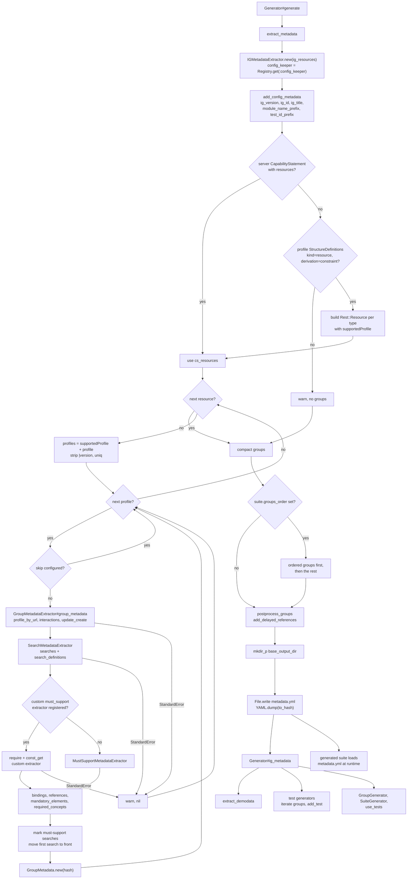
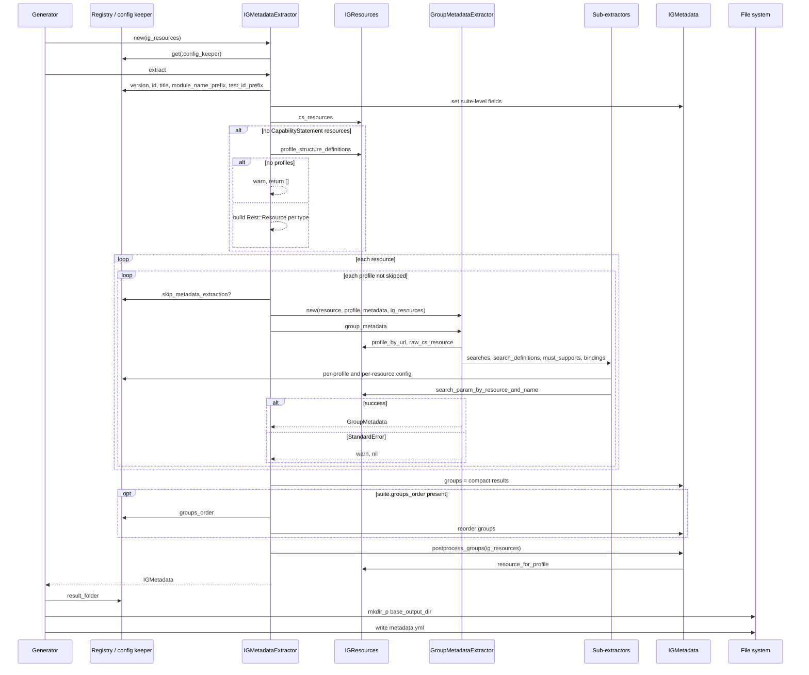

# extract_metadata: how the IG index becomes group metadata

Source files:

- [lib/inferno_suite_generator.rb](../lib/inferno_suite_generator.rb) (Generator#extract_metadata, Generator#base_output_dir)
- [lib/inferno_suite_generator/extractors/ig_metadata_extractor.rb](../lib/inferno_suite_generator/extractors/ig_metadata_extractor.rb) (IGMetadataExtractor)
- [lib/inferno_suite_generator/extractors/group_metadata_extractor.rb](../lib/inferno_suite_generator/extractors/group_metadata_extractor.rb) (GroupMetadataExtractor)
- [lib/inferno_suite_generator/extractors/search_metadata_extractor.rb](../lib/inferno_suite_generator/extractors/search_metadata_extractor.rb) (SearchMetadataExtractor)
- [lib/inferno_suite_generator/extractors/search_definition_metadata_extractor.rb](../lib/inferno_suite_generator/extractors/search_definition_metadata_extractor.rb) (SearchDefinitionMetadataExtractor)
- [lib/inferno_suite_generator/extractors/must_support_metadata_extractor.rb](../lib/inferno_suite_generator/extractors/must_support_metadata_extractor.rb) (MustSupportMetadataExtractor)
- [lib/inferno_suite_generator/extractors/terminology_binding_metadata_extractor.rb](../lib/inferno_suite_generator/extractors/terminology_binding_metadata_extractor.rb) (TerminologyBindingMetadataExtractor)
- [lib/inferno_suite_generator/core/ig_metadata.rb](../lib/inferno_suite_generator/core/ig_metadata.rb) (IGMetadata)
- [lib/inferno_suite_generator/core/group_metadata.rb](../lib/inferno_suite_generator/core/group_metadata.rb) (GroupMetadata)
- [lib/inferno_suite_generator/core/ig_resources.rb](../lib/inferno_suite_generator/core/ig_resources.rb) (IGResources lookups)
- [lib/inferno_suite_generator/core/generator_config_keeper.rb](../lib/inferno_suite_generator/core/generator_config_keeper.rb) (version, module_name_prefix, test_id_prefix, result_folder)
- [lib/inferno_suite_generator/core/config/getters.rb](../lib/inferno_suite_generator/core/config/getters.rb) (id, title, groups_order)
- [lib/inferno_suite_generator/core/config/extractors.rb](../lib/inferno_suite_generator/core/config/extractors.rb) (skip_metadata_extraction?, first_search_params, custom_extractors)
- [lib/inferno_suite_generator/core/config/utils.rb](../lib/inferno_suite_generator/core/config/utils.rb) (get, resolve_value)

---

## 1. What

```ruby
def extract_metadata
  self.ig_metadata = IGMetadataExtractor.new(ig_resources).extract

  FileUtils.mkdir_p(base_output_dir)
  File.write(File.join(base_output_dir, "metadata.yml"), YAML.dump(ig_metadata.to_hash))
end
```

extract_metadata turns the IGResources index built by load_ig_package into one IGMetadata object. It holds the suite-level names and one GroupMetadata per supported profile. The object is stored in Generator#ig_metadata and also written as YAML to RESULT_FOLDER/vVERSION/metadata.yml.

The inputs come from eight configurable places:

| # | Source | Config key | Default |
|---|--------|------------|---------|
| 1 | IG version, used for ig_version and the output folder | ig.version | [] |
| 2 | IG id | ig.id | none (nil) |
| 3 | Suite title, also the source of module_name_prefix, test_id_prefix and result_folder | suite.title | none (nil) |
| 4 | Order of groups by profile URL | suite.groups_order | [] |
| 5 | Skip a profile | configs.profiles.PROFILE_URL.skip or configs.resources.RESOURCE_TYPE.skip | false |
| 6 | Make _id the first search | configs.profiles.PROFILE_URL.first_class_profile or configs.resources.RESOURCE_TYPE.first_class_profile | false |
| 7 | Force the first search | configs.profiles.PROFILE_URL.forced_initial_search or configs.resources.RESOURCE_TYPE.forced_initial_search | [] (then ["patient"]) |
| 8 | Custom must-support extractor | configs.profiles.PROFILE_URL.register_extractors or configs.resources.RESOURCE_TYPE.register_extractors | [] |

For rows 5 to 8, resolve_value checks the profile key first and falls back to the resource key. A string value that names an entry in the top-level constants section is replaced by that entry. The nested extractors read more keys. They are listed in Step 5.

The output is an IGMetadata instance. Internally it holds:

- ig_version: "v" followed by ig.version, such as "v1.0.0"
- ig_id, ig_title, ig_module_name_prefix, ig_test_id_prefix: copied from the config keeper
- groups: an Array of GroupMetadata, one per (CapabilityStatement resource, profile) pair that did not fail or get skipped
- each GroupMetadata holds name, class_name, version, reformatted_version, resource, profile_url, profile_name, profile_version, title, short_description, interactions, update_create, update_create_expectation, operations, searches, search_definitions, include_params, revincludes, required_concepts, must_supports, mandatory_elements, bindings, references and delayed_references. tests, id and file_name are still nil at this point.

## 2. Why

Every later step of Generator#generate reads ig_metadata:

- base_output_dir uses ig_metadata.ig_version, so every generator writes under RESULT_FOLDER/vVERSION.
- IGDemodataExtractor (extract_demodata) uses resource_types_for_references, which reads references from all groups.
- SearchTestGenerator, ReadTestGenerator, ValidationTestGenerator, MustSupportTestGenerator, ReferenceResolutionTestGenerator, IncludeSearchTestGenerator, ProvenanceRevincludeSearchTestGenerator, ChainSearchTestGenerator, MultipleAndSearchTestGenerator, CreateTestGenerator, UpdateTestGenerator and PatchTestGenerator iterate ig_metadata.groups. MultipleOrSearchTestGenerator uses ig_metadata.search_groups.
- The test generators call GroupMetadata#add_test, which fills tests on the same in-memory objects.
- GroupGenerator iterates ig_metadata.ordered_groups (Patient group, then non-delayed, then delayed groups) and writes a per-group metadata.yml that includes the tests.
- SuiteGenerator uses ordered_groups, patch_interaction_exists?, ig_test_id_prefix, ig_module_name_prefix, reformatted_version, ig_title, ig_version and ig_id.
- use_tests uses ig_test_id_prefix and ig_version to build the require line in the main file.
- The generated suite (suite.rb.erb) loads the suite-level metadata.yml at runtime and builds GroupMetadata objects from its groups.

Building all metadata once lets the generators work from plain hashes and arrays and never read FHIR StructureDefinitions or the CapabilityStatement themselves.

Why build groups without a CapabilityStatement? Some IGs ship no server CapabilityStatement. In that case resources_in_capability_statement builds synthetic FHIR::CapabilityStatement::Rest::Resource objects from the profile StructureDefinitions, so metadata.yml can still be generated (commit f4c668d). These synthetic resources have only type and supportedProfile, so the groups have no interactions, searches or operations.

Why rescue errors per profile? extract_group_metadata wraps GroupMetadataExtractor in a rescue of StandardError. One broken or missing profile then drops only its group with a warning, and the rest of the suite is still generated.

Why reorder groups? suite.groups_order lets the user fix the order of groups in metadata.yml by profile URL (commit eac86c8). Groups not named in the list keep their original order after the named ones.

Why compute delayed references after all groups exist? A group is delayed when it has no patient search or is a listed non-USCDI resource. add_delayed_references needs the profile URLs of all delayed groups, so it can only run once the full groups list is known.

Why write metadata.yml here and not later? The generated suite reads it at runtime. It is written before any test generator runs, so it has no tests entries. The per-group metadata.yml files written by GroupGenerator carry the tests.

## 3. How (step by step)

### Step 0: Entry point

1. Generator#generate calls extract_metadata right after load_ig_package.
2. IGMetadataExtractor.new(ig_resources) stores the IGResources, creates an empty IGMetadata and gets the config from Registry.get(:config_keeper).
3. IGMetadataExtractor#extract calls add_config_metadata, then add_groups_metadata, and returns metadata.

### Step 1: Suite-level fields

add_config_metadata copies values from the config keeper:

1. ig_version = "v#{config_keeper.version}". version is read once in GeneratorConfigKeeper#load_config with get("ig.version", []).
2. ig_id = get("ig.id").
3. ig_title = get("suite.title").
4. ig_module_name_prefix = title.delete(" ").
5. ig_test_id_prefix = title.downcase.tr(" ", "_").

If suite.title is missing, title is nil and step 4 raises NoMethodError. Nothing rescues it.

### Step 2: Choose the CapabilityStatement resources

resources_in_capability_statement decides which rest.resource entries to process:

1. ig_resources.cs_resources finds the first CapabilityStatement that has a rest entry with mode "server" and returns rest.first.resource.
2. If that list is present, it is used as is.
3. Otherwise auto_detected_profile_resources runs:
   1. ig_resources.profile_structure_definitions selects StructureDefinitions with kind "resource", derivation "constraint" and a type.
   2. If there are none, it prints a warning with warn and returns []. No groups are generated.
   3. Otherwise the profiles are grouped by type, and one FHIR::CapabilityStatement::Rest::Resource is built per type with "type" and "supportedProfile" set to the profile URLs.

### Step 3: Collect profiles per resource

For each resource from Step 2, extract_metadata_for_cs_resource calls extract_resource_profiles:

1. It combines supportedProfile and profile, removes nils and duplicates, and strips any "|VERSION" suffix from each URL.
2. It rejects profiles where config_keeper.skip_metadata_extraction?(profile, cs_resource.type) is truthy.

### Step 4: Build one GroupMetadata per profile

For each remaining profile, extract_group_metadata runs GroupMetadataExtractor.new(resource, profile, metadata, ig_resources).group_metadata:

1. profile is looked up with ig_resources.profile_by_url(profile_url). profile_elements is profile.snapshot.element.
2. group_metadata_hash evaluates each field in order:
   - name and class_name come from the part of the URL after "StructureDefinition/". class_name inserts reformatted_version after ig_module_name_prefix and appends "Sequence".
   - version and reformatted_version come from ig_metadata.
   - resource is the CapabilityStatement resource type.
   - profile_name, profile_version and title come from the profile. title removes suite.title and the word "Profile". For Condition, DiagnosticReport and Observation it prefixes the resource type when the title does not start with it, except for v3.1.1.
   - interactions maps each interaction to code and expectation. The expectation is the first extension valueCode, or "SHALL".
   - update_create is resource.updateCreate or false.
   - update_create_expectation reads the raw CapabilityStatement JSON with ig_resources.raw_cs_resource(resource) and runs Fhirpath.evaluate for the capabilitystatement-expectation extension on updateCreate. It returns "MAY" when there is no raw JSON or no match.
   - operations maps each operation to name and the first extension valueCode.
   - searches and search_definitions come from SearchMetadataExtractor (Step 5).
   - include_params and revincludes are searchInclude and searchRevInclude, or [].
   - required_concepts lists CodeableConcept elements with a required binding. It is [] for Observation.
   - must_supports comes from a custom extractor or MustSupportMetadataExtractor (Step 5).
   - mandatory_elements lists paths of elements with min greater than 0.
   - bindings comes from TerminologyBindingMetadataExtractor (Step 5).
   - references lists Reference elements with path, target profiles and, when found, resource_types from ig_resources.resource_for_profile.
3. mark_mandatory_and_must_support_searches sets names_not_must_support_or_mandatory and must_support_or_mandatory on each search. A name counts as covered when it is _id, or when one of its full_paths matches a must-support element, a must-support type slice or a mandatory element.
4. handle_special_cases moves the search whose names equal first_search_params to the front. first_search_params is ["_id"] when first_class_profile is set, the forced_initial_search value when it is not empty, and ["patient"] otherwise.
5. GroupMetadata.new(hash) builds the object. It raises for unknown keys.
6. Any StandardError in this step is rescued. It prints "Error extracting metadata for profile PROFILE of resource TYPE: MESSAGE" with warn and returns nil. Examples: the profile is not in the IG, so profile is nil; a search parameter is not found, so param.source_hash fails; a custom extractor fails to load.

### Step 5: Nested extractors

These run lazily while group_metadata_hash is evaluated.

1. SearchMetadataExtractor#searches:
   1. basic_searches takes each searchParam whose expectation is in configs.generic.expectation (default []) and whose name is not in configs.generic.search_params_to_ignore (default []).
   2. combo_searches takes the capabilitystatement-search-parameter-combination extensions with an allowed expectation. It removes ignored names, drops combos left with one name, merges duplicates and keeps the highest expectation (SHALL, then SHOULD, then MAY).
   3. handle_special_cases changes a search expectation from "from" to "to" when search_param.PARAM.expectation_change is set for the profile or resource.
   4. Because the default for configs.generic.expectation is [], no searches are produced unless it is configured.
2. SearchDefinitionMetadataExtractor builds one definition per search name: paths, full_paths, comparators, values, type, contains_multiple, multiple_or, multiple_and, chain and target_resource. It reads search_param.PARAM.comparators, multiple_or_expectation, multiple_and_expectation and default_values. The SearchParameter comes from ig_resources.search_param_by_resource_and_name.
3. must_supports:
   - If register_extractors has an entry with extractor_type "must_support", use_custom_extractor requires the file at path_to_extractor, resolves extractor_class with Object.const_get and calls must_supports on a new instance. A load error is printed and nil is returned, so the next call on nil fails and Step 4 rescues it.
   - Otherwise MustSupportMetadataExtractor returns extensions, slices and elements. It removes entries listed in exclude_elements_from_must_support and exclude_slices_from_must_support and applies slice_discriminator_default_value.
4. TerminologyBindingMetadataExtractor returns required bindings from profile elements and from must-support extension profiles.

### Step 6: Collect and order groups

1. add_groups_metadata flat_maps the results of Steps 3 and 4 over all resources and calls compact, so nil results from Step 4 are dropped.
2. reorder_groups reads suite.groups_order. If it is blank, the list is unchanged.
3. Otherwise groups are grouped by profile_url. Groups named in groups_order come first in that order. The remaining groups follow in their original order. URLs in groups_order that match no group are ignored.

### Step 7: Delayed references

1. metadata.postprocess_groups(ig_resources) is called.
2. delayed_profiles collects profile_url of every group where delayed? is true. delayed? is false for Patient and true when the group has no search that includes "patient", or when the resource and version are listed in GroupMetadata::NON_USCDI_RESOURCES.
3. For each group, add_delayed_references keeps the references whose target profiles include a delayed profile. It stores the path without the "RESOURCE." prefix and the resource types from ig_resources.resource_for_profile.
4. delayed_groups, delayed_profiles and the other IGMetadata helpers are memoized on first call.

### Step 8: Write metadata.yml

1. base_output_dir is File.join(config.result_folder, ig_metadata.ig_version). result_folder is "./lib/TEST_ID_PREFIX_test_kit/generated/".
2. FileUtils.mkdir_p creates the folder.
3. ig_metadata.to_hash returns ig_id, ig_title, ig_module_name_prefix, ig_test_id_prefix, ig_version and groups. Each group's to_hash leaves out nil attributes.
4. YAML.dump serialises it with symbol keys, and File.write overwrites metadata.yml. File errors are not rescued.

### Step 9: Return

extract returns the IGMetadata instance, which is assigned to Generator#ig_metadata. extract_metadata itself returns the result of File.write, which Generator#generate does not use.

## 4. Diagrams

### Flow



### Sequence


