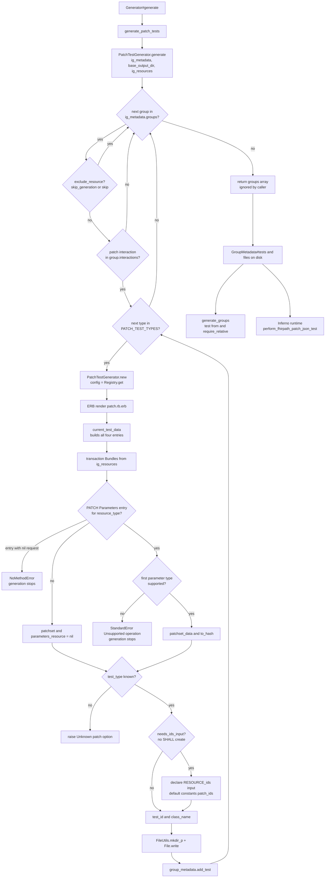
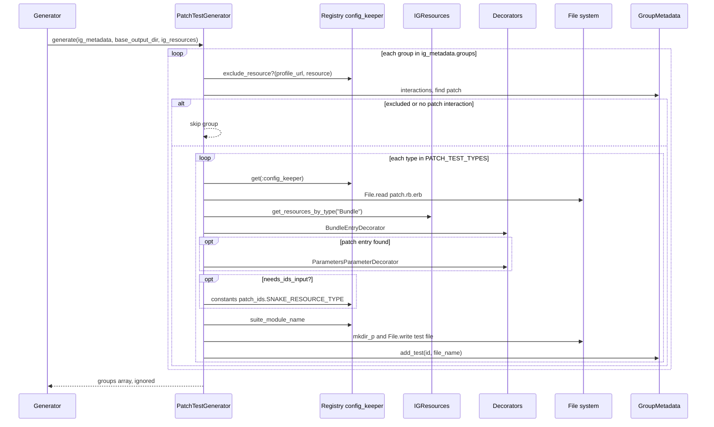

# generate_patch_tests: how PATCH interaction tests are generated

Source files:

- [lib/inferno_suite_generator.rb](../lib/inferno_suite_generator.rb) (Generator#generate_patch_tests)
- [lib/inferno_suite_generator/generators/patch_test_generator.rb](../lib/inferno_suite_generator/generators/patch_test_generator.rb) (PatchTestGenerator)
- [lib/inferno_suite_generator/utils/patch_test_generator_helpers.rb](../lib/inferno_suite_generator/utils/patch_test_generator_helpers.rb) (PatchTestGeneratorHelpers)
- [lib/inferno_suite_generator/generators/basic_test_generator.rb](../lib/inferno_suite_generator/generators/basic_test_generator.rb) (BasicTestGenerator)
- [lib/inferno_suite_generator/utils/generator_constants.rb](../lib/inferno_suite_generator/utils/generator_constants.rb) (GeneratorConstants)
- [lib/inferno_suite_generator/decorators/bundle_entry_decorator.rb](../lib/inferno_suite_generator/decorators/bundle_entry_decorator.rb) (BundleEntryDecorator)
- [lib/inferno_suite_generator/decorators/parameters_parameter_decorator.rb](../lib/inferno_suite_generator/decorators/parameters_parameter_decorator.rb) (ParametersParameterDecorator)
- [lib/inferno_suite_generator/core/group_metadata.rb](../lib/inferno_suite_generator/core/group_metadata.rb) (GroupMetadata#needs_ids_input?, GroupMetadata#add_test)
- [lib/inferno_suite_generator/core/ig_resources.rb](../lib/inferno_suite_generator/core/ig_resources.rb) (IGResources#get_resources_by_type)
- [lib/inferno_suite_generator/core/config/generators.rb](../lib/inferno_suite_generator/core/config/generators.rb) (GeneratorConfigKeeper#exclude_resource?)
- [lib/inferno_suite_generator/core/config/utils.rb](../lib/inferno_suite_generator/core/config/utils.rb) (resolve_value, constants)
- [lib/inferno_suite_generator/core/generator_config_keeper.rb](../lib/inferno_suite_generator/core/generator_config_keeper.rb) (suite_module_name)
- [lib/inferno_suite_generator/utils/naming.rb](../lib/inferno_suite_generator/utils/naming.rb) (Naming.snake_case_for_profile)
- [lib/inferno_suite_generator/templates/patch.rb.erb](../lib/inferno_suite_generator/templates/patch.rb.erb) (the generated test template)
- [lib/inferno_suite_generator/test_modules/patch_test.rb](../lib/inferno_suite_generator/test_modules/patch_test.rb) (PatchTest, the runtime module the generated tests include)

---

## 1. What

```ruby
def generate_patch_tests
  PatchTestGenerator.generate(ig_metadata, base_output_dir, ig_resources)
end
```

generate_patch_tests writes one Inferno test file per group whose CapabilityStatement entry declares the patch interaction. Each file is written to BASE_OUTPUT_DIR/PROFILE_IDENTIFIER/, where BASE_OUTPUT_DIR is RESULT_FOLDER/IG_VERSION. The method also registers each new test in its GroupMetadata#tests list. It returns nothing useful and assigns nothing on Generator.

The inputs come from four configurable places:

| # | Source | Config key | Default |
|---|--------|------------|---------|
| 1 | Skip flag for a profile | configs.profiles.PROFILE_URL.skip_generation or configs.profiles.PROFILE_URL.skip | nil (not skipped) |
| 2 | Skip flag for a resource type | configs.resources.RESOURCE_TYPE.skip_generation or configs.resources.RESOURCE_TYPE.skip | nil (not skipped) |
| 3 | Default for the IDs input | constants, key patch_ids.SNAKE_RESOURCE_TYPE | "" |
| 4 | Suite title, used for the outer module name | suite.title | none |

The output has two parts:

- A file per patched group, for example patient/patient_fhir_path_json_patch_test.rb, holding a class such as PatientFHIRPathJSONPatchTest that inherits from Inferno::Test and includes InfernoSuiteGenerator::PatchTest.
- An entry { id: TEST_ID, file_name: FILE_NAME } appended to GroupMetadata#tests for that group. TEST_ID has the form IG_TEST_ID_PREFIX_VERSION_PROFILE_IDENTIFIER_fhirpath_json_patch_test.

## 2. Why

The generated files and the tests list feed later steps:

- GroupGenerator (generate_groups) reads group_metadata.tests. It adds a require_relative for each file_name and a "test from: :TEST_ID" line for each id to the group file. It then writes the group's metadata.yml, which includes the tests list.
- The generated test runs at Inferno runtime through PatchTest#perform_fhirpath_patch_json_test. That method takes patch bodies from demodata.yml (patch_body_list, written by extract_demodata) or from the extra_bundle suite input. It takes resource IDs from teardown_candidates or from demodata resource_ids.

The generator only decides which tests exist and how they are named. Patch payloads stay out of the generated code, so they can change without a new generation.

Why generate only FHIRPathJSON? PATCH_TEST_TYPES is %w[FHIRPathJSON]. The full list XML, JSON, FHIRPathXML, FHIRPathJSON is kept as a comment. Commit a545637 cut the options down to JSON, and commit 2a59d20 switched to FHIRPathJSON when perform_fhirpath_patch_json_test was implemented. In PatchTest, perform_xml_patch_test and perform_fhirpath_patch_xml_text still only call skip "Not implemented".

Why is ig_resources passed if the file holds no patch body? The helpers still find a PATCH entry in the IG's transaction Bundles and build patchset and create_patch_data from it. The template stopped rendering that data in commit ffe6ed4, which removed the patch_data method from patch.rb.erb and moved payload loading to BasicTest#patch_body_list at runtime. The lookup still runs during rendering, so it can still raise (see Step 4).

Why add an IDs input only for some groups? GroupMetadata#needs_ids_input? is true when the group has no create interaction with expectation SHALL. Only then does the template declare a RESOURCE_ids input.

## 3. How (step by step)

### Step 0: Entry point

1. Generator#generate calls generate_patch_tests after generate_update_tests and before generate_groups.
2. It calls PatchTestGenerator.generate(ig_metadata, base_output_dir, ig_resources).
3. base_output_dir is File.join(Registry.get(:config_keeper).result_folder, ig_metadata.ig_version).

### Step 1: Loop over groups

1. ig_metadata.groups.each calls group_generate(group, base_output_dir, { ig_metadata:, ig_resources: }).
2. The loop covers all groups, not ordered_groups.

### Step 2: Decide whether to skip the group

skip_generate?(group) is true if either check is true:

1. Registry.get(:config_keeper).exclude_resource?(group.profile_url, group.resource) returns a truthy value. It calls resolve_value for skip_generation, then for skip. Each resolve_value looks under configs.profiles.PROFILE_URL first and then under configs.resources.RESOURCE_TYPE. A found value is also looked up in constants.
2. patch_interaction(group) is not present. It is the first entry in group.interactions whose :code is "patch".

A skipped group gets no file and no tests entry.

### Step 3: Build one generator per patch type

1. For each patch_option in PATCH_TEST_TYPES (only "FHIRPathJSON"), PatchTestGenerator.new(group, base_output_dir, ig_metadata, patch_option, ig_resources) is created.
2. BasicTestGenerator#initialize stores group_metadata, base_output_dir and ig_metadata.
3. PatchTestGenerator#initialize stores test_type, ig_resources and config = Registry.get(:config_keeper).
4. template_type is TEMPLATE_TYPES[:PATCH], which is "patch".
5. generate is called on the instance.

### Step 4: Render the template

BasicTestGenerator#output reads templates/patch.rb.erb (TEMPLATE_FILES_MAP["patch"]) with File.read and renders it with ERB.new(template).result(binding). The template calls these methods:

1. suite_module_name: config.suite_module_name, which is suite.title without spaces plus "TestKit".
2. module_name: ig_metadata.ig_module_name_prefix plus group_metadata.reformatted_version.upcase.
3. class_name: Naming.upper_camel_case_for_profile(group_metadata) plus test_type plus "PatchTest", for example PatientFHIRPathJSONPatchTest.
4. conformance_expectation: the :expectation of the patch interaction, used in the title and description.
5. resource_type: group_metadata.resource.
6. humanized_option, test_id_option and executor read current_test_data:
   1. current_test_data builds a hash with all four types at once. It calls xml_test_data(patchset_with_dec), json_test_data(patchset_with_dec), fhirpath_xml_data(parameters_resource) and fhirpath_json_data(parameters_resource). This happens on every call, whatever test_type is.
   2. transaction_bundles calls ig_resources.get_resources_by_type("Bundle") and keeps bundles with type "transaction". It returns [] when ig_resources is nil.
   3. bundle_entries flattens the entries of those bundles.
   4. patch_entry is the first entry where BundleEntryDecorator#bundle_entry_patch_parameter?(resource_type) is true. That means request.local_method is "PATCH", the first segment of request.url equals the resource type, and the entry resource is a Parameters resource. An entry with a nil request raises NoMethodError here. It is not rescued.
   5. patchset_with_dec passes the first parameter of patch_entry to ParametersParameterDecorator#patchset_data. normalize_operation raises StandardError "Unsupported operation OP" for any type other than add, replace, test, move, copy, remove or delete. FHIRPath Patch "insert" is one such value. It is not rescued and stops the whole generation.
   6. parameters_resource is patch_entry.resource.to_hash, or nil.
   7. If test_type is not a key of the hash, it raises "Unknown patch option: TEST_TYPE".
   8. For FHIRPathJSON the values are "FHIRPath Patch in JSON format", "fhirpath_json" and "perform_fhirpath_patch_json_test".
7. ids_input_data (optional): returns nil unless group_metadata.needs_ids_input? is true. Otherwise it returns id SNAKE_RESOURCE_TYPE_ids, title "RESOURCE_TYPE IDs", description "Comma separated list of RESOURCE TYPE" and default constants["patch_ids.SNAKE_RESOURCE_TYPE"] or "".
8. test_id: for the patch template type it is BASIC_TEST_ID_fhirpath_json_patch_test. BASIC_TEST_ID is ig_metadata.ig_test_id_prefix, group_metadata.reformatted_version and profile_identifier joined with "_".

The rendered class also defines self.demodata, which loads demodata.yml from the parent folder, and self.metadata, which loads metadata.yml from its own folder. Its run block calls the executor.

The methods patchset and create_patch_data exist on PatchTestGenerator but the template does not call them.

### Step 5: Write the file

1. FileUtils.mkdir_p(output_file_directory), which is File.join(base_output_dir, profile_identifier).
2. File.write(output_file_name, output). The file name is class_name.underscore plus ".rb", for example patient_fhir_path_json_patch_test.rb. An existing file is overwritten.

### Step 6: Register the test

1. group_metadata.add_test(id: test_id, file_name: base_output_file_name).
2. add_test creates the tests array if needed.
3. The entry is appended. It goes to the front only if group_metadata.delayed? is true and the id contains "read".

### Step 7: Return

PatchTestGenerator.generate returns the result of ig_metadata.groups.each, which is the groups array. generate_patch_tests returns it too, but Generator#generate ignores it. The real results are the files on disk and the updated GroupMetadata#tests lists inside ig_metadata.

## 4. Diagrams

### Flow



### Sequence


