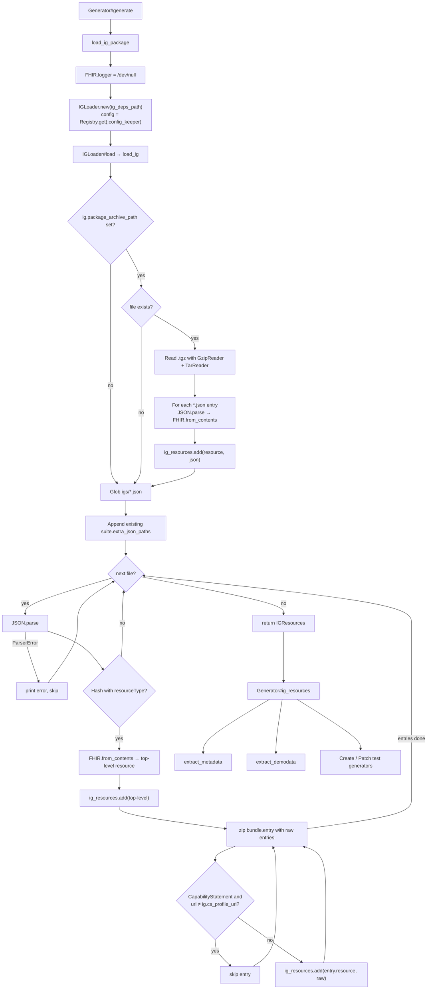
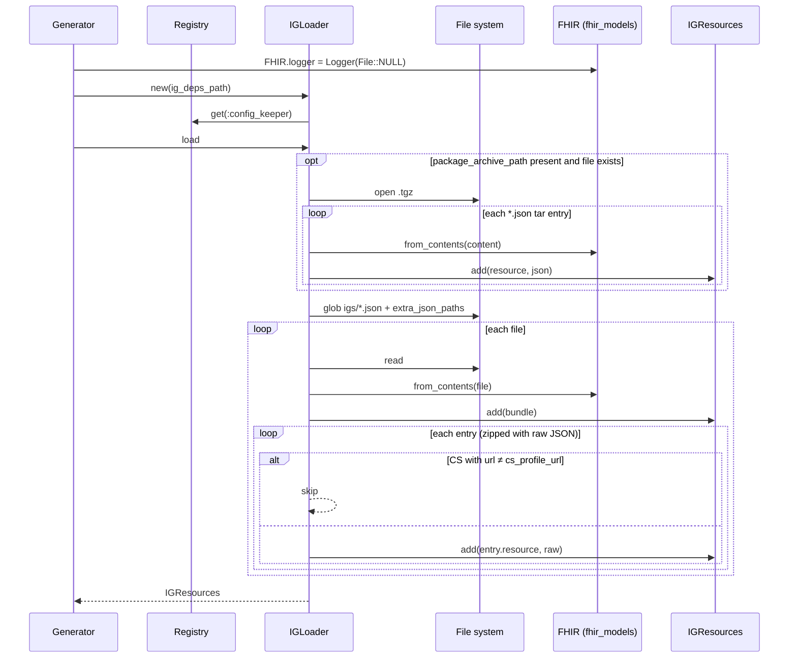

# load_ig_package: how the IG gets loaded

Source files:

- [lib/inferno_suite_generator.rb](../lib/inferno_suite_generator.rb) (Generator#load_ig_package)
- [lib/inferno_suite_generator/core/ig_loader.rb](../lib/inferno_suite_generator/core/ig_loader.rb) (IGLoader)
- [lib/inferno_suite_generator/core/ig_resources.rb](../lib/inferno_suite_generator/core/ig_resources.rb) (IGResources)
- [lib/inferno_suite_generator/core/config/getters.rb](../lib/inferno_suite_generator/core/config/getters.rb) (the config values it reads)

---

## 1. What

```ruby
def load_ig_package
  FHIR.logger = Logger.new(File::NULL)
  self.ig_resources = IGLoader.new(ig_deps_path).load
end
```

load_ig_package reads every FHIR artifact. It parses them into fhir_models objects and indexes them by resourceType in one IGResources object, which it stores in Generator#ig_resources.

The inputs come from two configurable places:

| # | Source | Config key | Default |
|---|--------|------------|---------|
| 1 | An NPM package archive (.tgz / .tar.gz) | ig.package_archive_path | none (skipped) |
| 2 | Extra JSON files | suite.extra_json_paths | [] |

The output is an IGResources instance. Internally it holds:

- resources_by_type: Hash<String, Array<FHIR::Model>>, such as "StructureDefinition" => [...]
- raw_capability_statements: an identity-keyed hash from each CapabilityStatement object to its raw JSON hash

## 2. Why

Everything later in the pipeline depends on this index:

- IGMetadataExtractor (extract_metadata) uses ig, capability_statement, cs_resources, profile_by_url, search_param_by_resource_and_code, value_set_by_url and others to build ig_metadata, which drives all test generators.
- IGDemodataExtractor (extract_demodata) looks up example resources with get_resources_by_type.
- CreateTestGenerator and PatchTestGenerator get ig_resources directly to find example payloads.

Loading everything once into memory lets the rest of the generator run plain Ruby lookups and avoid touching the filesystem again.

Why keep raw JSON for CapabilityStatements? fhir_models drops elements it does not model, such as some extensions and elements from other FHIR versions. raw_cs_resource(type) gives extractors the original JSON of a rest.resource entry, which is needed for things like updateCreate detection (see commit 4d33b14).

Why silence FHIR.logger? Parsing hundreds of IG resources makes fhir_models log a warning for every unknown element or validation issue. Those warnings would bury the generator's own output.

## 3. How (step by step)

### Step 0: Entry point

1. Generator#generate calls load_ig_package first.
2. FHIR.logger is replaced with a logger that writes to /dev/null. This is global and permanent for the process.
3. IGLoader.new(ig_deps_path) stores the path and gets the config from Registry.get(:config_keeper).
4. IGLoader#load calls load_ig.

### Step 1: Package archive (optional)

This step runs only when config.package_archive_path is truthy.

1. The path is resolved against Dir.pwd unless it is absolute.
2. If the file does not exist, the step returns without any message.
3. The archive is opened with Zlib::GzipReader and read with Gem::Package::TarReader.
4. For each tar entry that is a regular file, ends in .json and does not end in .openapi.json:
   1. JSON.parse the content. The entry is skipped unless it is a Hash with resourceType.
   2. FHIR.from_contents(content) turns it into a model object.
   3. ig_resources.add(resource, json) stores it. The raw JSON is kept only if it is a CapabilityStatement.
   4. Any error is printed and the entry is skipped.
5. Gzip, tar or other errors print a message and end the archive step.

### Step 2: Collect JSON file paths

1. Dir.glob("#{Dir.pwd}/#{config.ig_deps_path}/*.json") lists the files. This is not recursive and only covers the top level of igs/.
2. For each entry in config.extra_json_paths, the path is resolved against Dir.pwd unless absolute. Missing paths are skipped without a message.

### Step 3: Parse each JSON file

For each file (it prints "Loading JSON file: PATH"):

1. Read the file and run JSON.parse. The file is skipped unless it is a Hash with resourceType.
2. bundle = FHIR.from_contents(file_content).
3. ig_resources.add(bundle). The top-level resource, usually a Bundle, is indexed as well.
4. bundle.entry is zipped with the raw json["entry"] array so each parsed entry is paired with its raw JSON.
5. For each entry:
   - If it is a CapabilityStatement whose url is not equal to config.cs_profile_url, it is skipped. This keeps only the one CS the suite targets.
   - Otherwise ig_resources.add(entry.resource, raw_entry["resource"]).
6. JSON::ParserError is printed and the file is skipped. No other error is rescued here.

### Step 4: Return

load_ig returns the memoized IGResources, which is assigned to Generator#ig_resources.

## 4. Diagrams

### Flow



### Sequence


