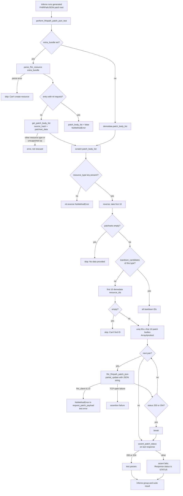
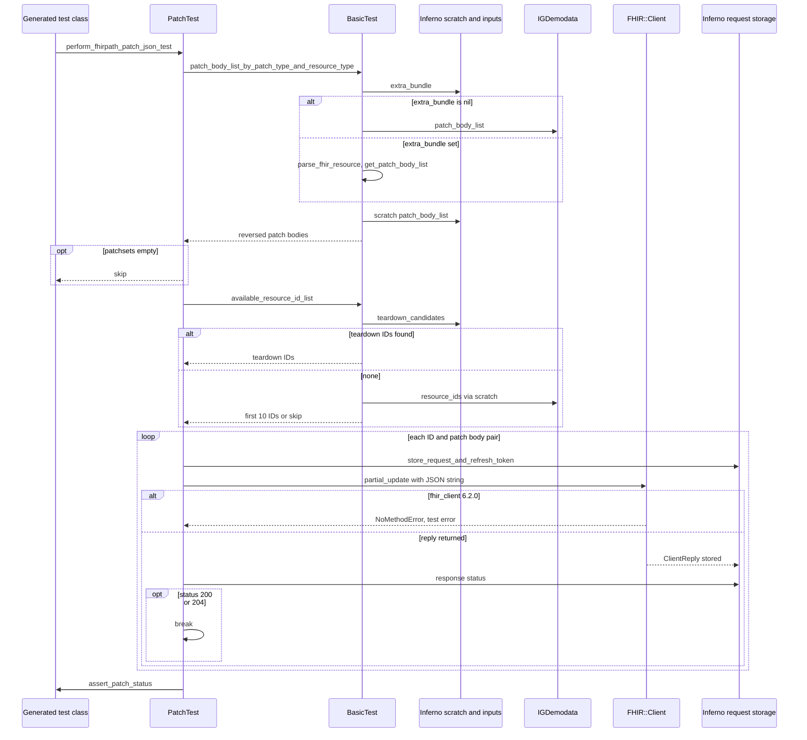

# perform_fhirpath_patch_json_test: how the generated PATCH test checks a server at runtime

Source files:

- [lib/inferno_suite_generator/test_modules/patch_test.rb](../lib/inferno_suite_generator/test_modules/patch_test.rb) (PatchTest#perform_fhirpath_patch_json_test, PatchTest#fhir_fhirpath_patch_json)
- [lib/inferno_suite_generator/test_modules/basic_test.rb](../lib/inferno_suite_generator/test_modules/basic_test.rb) (BasicTest#patch_body_list, BasicTest#patch_body_list_from_input, BasicTest#get_patch_body_list, BasicTest#patch_body_list_by_patch_type_and_resource_type, BasicTest#available_resource_id_list)
- [lib/inferno_suite_generator/utils/basic_test_helpers.rb](../lib/inferno_suite_generator/utils/basic_test_helpers.rb) (BasicTestHelpers#default_patch_body_list)
- [lib/inferno_suite_generator/decorators/parameters_parameter_decorator.rb](../lib/inferno_suite_generator/decorators/parameters_parameter_decorator.rb) (ParametersParameterDecorator#patchset_data)
- [lib/inferno_suite_generator/core/ig_demodata.rb](../lib/inferno_suite_generator/core/ig_demodata.rb) (IGDemodata, the object loaded from demodata.yml)
- [lib/inferno_suite_generator/extractors/ig_demodata_extractor.rb](../lib/inferno_suite_generator/extractors/ig_demodata_extractor.rb) (IGDemodataExtractor#add_patch_body_list, which fills patch_body_list at generation time)
- [lib/inferno_suite_generator.rb](../lib/inferno_suite_generator.rb) (Generator#extract_demodata, which writes demodata.yml)
- [lib/inferno_suite_generator/templates/patch.rb.erb](../lib/inferno_suite_generator/templates/patch.rb.erb) (the generated test class that calls the method)
- [lib/inferno_suite_generator/templates/suite.rb.erb](../lib/inferno_suite_generator/templates/suite.rb.erb) (the extra_bundle suite input)
- [lib/inferno_suite_generator/utils/patch_test_generator_helpers.rb](../lib/inferno_suite_generator/utils/patch_test_generator_helpers.rb) (maps FHIRPathJSON to this executor)
- External: inferno_core 1.4.4 (store_request_and_refresh_token, tcp_exception_handler, fhir_class_from_resource_type, resource, response, skip, info, assert) and fhir_client 6.2.0 (FHIR::Client#partial_update, FHIR::Client#patch)

---

## 1. What

```ruby
def perform_fhirpath_patch_json_test
  patchsets = patch_body_list_by_patch_type_and_resource_type("FHIRPATHPatchJson", resource_type)
  skip skip_message(resource_type) if patchsets.nil? || patchsets.empty?

  available_resource_id_list.uniq.product(patchsets[0..9]).each do |resource_id, parameters_resource_hash|
    fhir_fhirpath_patch_json(resource_type, resource_id, parameters_resource_hash)
    break if [SUCCESS, SUCCESS_NO_CONTENT].include?(response[:status])
  end

  assert_patch_status
end
```

perform_fhirpath_patch_json_test runs inside Inferno, not inside the generator. It is the run block of every generated FHIRPathJSON patch test. It takes FHIRPath Patch Parameters bodies for the test's resource type, pairs them with existing resource IDs, and sends them to the server as PATCH requests. The test passes as soon as one PATCH call returns status 200 or 204. The response body and its versionId are not checked. The result is an Inferno test outcome (pass, fail, skip or error) plus the stored requests. Nothing is written to scratch.

The method reads no generator config keys. Its inputs come from three configurable places:

| # | Source | Config key | Default |
|---|--------|------------|---------|
| 1 | Suite input with a transaction Bundle of PATCH entries | extra_bundle | nil (optional input; demodata.yml is used instead) |
| 2 | Patch bodies extracted from the IG | demodata.yml, key patch_body_list, sub-key :FHIRPATHPatchJson | PATCH entries of the IG's Bundles, written by extract_demodata |
| 3 | Resource IDs extracted from the IG | demodata.yml, key resource_ids | IDs of the IG's example resources, written by extract_demodata |

The output is the test result. Internally the method builds:

- patchsets: an Array of raw Parameters hashes (source_hash of each PATCH entry resource), in reversed order.
- The pairs [resource_id, parameters_resource_hash] from Array#product of the unique IDs and the first ten patch bodies. They are iterated directly and not stored.

## 2. Why

The result is used by:

- The generated test class from patch.rb.erb, for example PatientFHIRPathJSONPatchTest. Its run block is only this call. PatchTestGeneratorHelpers maps the FHIRPathJSON test type to the executor name perform_fhirpath_patch_json_test.
- The Inferno group and suite that include that test. They report the test's pass, fail, skip or error status and show the stored PATCH requests.

Keeping the logic in a shared runtime module means the generated file holds no patch payloads and no test logic. Payloads can change through demodata.yml or the extra_bundle input without regenerating the suite.

Why check only the response status? The client asked for the test to ignore versionId. A server may answer a successful PATCH with 204 and no body, or with a body whose meta.versionId does not change, so the status is the only signal the test relies on. Earlier versions of the method required two consecutive requests on the same ID and a strictly higher versionId on the second one (commits 05d07a4 and a3c270e). That rule was removed. The method now uses the same assert_patch_status as perform_json_patch_test, so both 200 (SUCCESS) and 204 (SUCCESS_NO_CONTENT) pass.

Why try several ID and body pairs? A PATCH body from the IG may not apply to every example resource on the server, and an ID may not exist there. The loop keeps trying until one pair succeeds, then stops with break.

Why call uniq on the IDs? Commit fd7fd2e added it to deduplicate resource IDs, together with the early break on success. A duplicated ID would otherwise get a second set of requests.

Why limit to ten patch bodies and ten demo IDs? patchsets[0..9] and existing_demo_resources[0..9] cap the number of requests to at most 100 when demo IDs are used. IDs from teardown_candidates are not capped.

Why build Content-Type and Accept headers that are never sent? fhir_fhirpath_patch_json sets them on the hash returned by fhir_client.fhir_headers. That method builds a new hash each time, and the hash is not passed on. Before commit 212ef23 the hash was passed to fhir_client.send(:patch, path, body, headers). That commit switched to partial_update and left the header code in place.

## 3. How (step by step)

### Step 0: Entry point

1. At generation time, generate_patch_tests renders patch.rb.erb with executor perform_fhirpath_patch_json_test. The class includes InfernoSuiteGenerator::PatchTest and defines resource_type, self.demodata (loads demodata.yml from the parent folder with YAML.load_file) and self.metadata.
2. At runtime, Inferno runs the test's run block, which calls perform_fhirpath_patch_json_test.
3. demodata and metadata are delegated to the class through Forwardable in BasicTest.

### Step 1: Load the patch bodies

1. patch_body_list_by_patch_type_and_resource_type("FHIRPATHPatchJson", resource_type) calls patch_body_list_by_patch_type, which calls patch_body_list.
2. patch_body_list picks the source:
   1. If extra_bundle is nil, it uses demodata.patch_body_list.
   2. Otherwise it calls patch_body_list_from_input (Step 1a).
   3. The value is memoized in scratch[:patch_body_list] with ||=. The source expression is evaluated before the ||= check, so patch_body_list_from_input runs on every call while extra_bundle is set.
3. patch_body_list_by_patch_type returns patch_body_list[:FHIRPATHPatchJson], or {} if that key is missing.
4. [resource_type].reverse is called on it. The last PATCH entry for the type comes first. If the resource type has no key, nil.reverse raises NoMethodError, which is not rescued. The trailing || [] never applies.

### Step 1a: Read patch bodies from extra_bundle (optional)

This step runs only when the extra_bundle input is not nil. The suite declares the input only when some group has a patch interaction, and Inferno passes it down to the test.

1. info "The test suite will use the data from the provided bundle to PATCH resources".
2. parse_fhir_resource(extra_bundle) calls FHIR.from_contents. Any StandardError becomes skip "Can't create resource from provided data: MESSAGE".
3. bundle.entry.select keeps entries whose request.local_method is "PATCH". The block uses return false for an entry with a nil request, which returns false from patch_body_list_from_input itself. patch_body_list then becomes false, and false[:FHIRPATHPatchJson] raises NoMethodError.
4. get_patch_body_list starts from default_patch_body_list, which holds empty arrays for the test's resource_type only, under both :FHIRPATHPatchJson and :JSONPatch.
5. For each PATCH entry:
   1. The resource type is the first segment of request.url.
   2. entry.resource.source_hash is appended under :FHIRPATHPatchJson.
   3. ParametersParameterDecorator#patchset_data of the first parameter is appended under :JSONPatch. It raises StandardError "Unsupported operation OP" for an operation other than add, replace, test, move, copy, remove or delete.
   4. An entry for a different resource type hits a nil array and raises NoMethodError.
6. None of these errors are rescued.

### Step 2: Skip if there is nothing to send

1. If patchsets is nil or empty, skip "No RESOURCE_TYPE data provided for patch test". skip raises and ends the test.
2. An empty array is possible through extra_bundle, because default_patch_body_list creates an empty array for the resource type.

### Step 3: Take at most ten patch bodies

1. parameters_resource_hash_list = patchsets[0..9].

### Step 4: Collect resource IDs

available_resource_id_list returns:

1. The IDs of teardown_candidates (scratch[:teardown_candidates]) whose resourceType equals resource_type, if there are any. These are resources that earlier tests in the session registered with register_teardown_candidate. They are not capped.
2. Otherwise the first ten entries of existing_demo_resources, which is demo_resources[resource_type]. demo_resources is scratch[:resource_ids] ||= demodata.resource_ids.
3. If that list is empty, skip "Can't find ID of resource RESOURCE_TYPE for UPDATE".

The RESOURCE_ids input that the template declares for some groups is not read by this method.

### Step 5: Pair IDs with patch bodies

1. .uniq removes duplicate IDs.
2. .product(patchsets[0..9]) builds every [resource_id, parameters_resource_hash] pair.
3. The order is ID by ID. All bodies for the first ID come before any body for the second ID.

### Step 6: Send PATCH requests until one succeeds

For each pair:

1. fhir_fhirpath_patch_json(resource_type, resource_id, parameters_resource_hash):
   1. store_request_and_refresh_token(fhir_client(:default), nil, []) refreshes the access token if needed and stores the returned FHIR::ClientReply as an outgoing request.
   2. tcp_exception_handler turns a Faraday::ConnectionFailed or SocketError whose message contains "Failed to open TCP" into an assertion failure. Other errors are re-raised.
   3. headers = fhir_client.fhir_headers, then Content-Type and Accept are set to application/fhir+json. This hash is not used afterwards.
   4. body = parameters_resource_hash.to_json, a String.
   5. fhir_client.partial_update(fhir_class_from_resource_type(resource_type), resource_id, body). fhir_class_from_resource_type returns FHIR.const_get(resource_type.camelize).
   6. Inside fhir_client 6.2.0, the Inferno client uses default_json, so partial_update sets Content-Type to application/json-patch+json. FHIR::Client#patch then calls request_patch_payload(body, that type), which calls body.each. A String has no each method, so NoMethodError is raised before any HTTP request is sent. This was reproduced locally with the locked gem versions. It is not rescued, no request is stored, and Inferno reports the test as an error. The steps below describe the code path as written.
2. If response[:status] is 200 or 204, the loop stops with break.
3. Otherwise the next pair is tried. Nothing is carried over between requests.

### Step 7: Assert and return

1. assert_patch_status reads response[:status] of the last stored request and asserts that it is 200 or 204. Because the loop stops on the first success, the last request is successful only if some request succeeded.
2. On failure the message is "Response status is STATUS. Expected 200 or 204", with the status of the last request.
3. The method returns nil when the assertion passes. The outcome is recorded by Inferno as the result of the generated test.

## 4. Diagrams

### Flow



### Sequence


